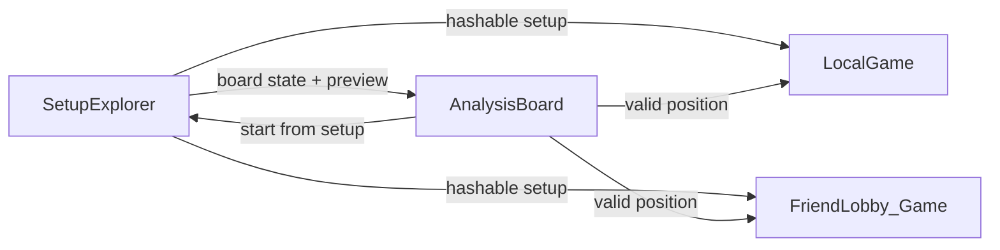

# Tribun — Product milestones (M01–M10)

Single-file specification for all milestones, in **fixed order** M01 through M10.

---

## M01 — Login: Cloudflare CAPTCHA and bot protection

### Objective

Require successful **Cloudflare CAPTCHA** (e.g. Turnstile) on login (and related auth surfaces as needed), plus **additional non-invasive** bot mitigation, so automated abuse is reduced without hostile UX.

### Scope

- Client: integrate CAPTCHA widget / invisible flow; send verifiable token to the server.
- Server: verify CAPTCHA token with Cloudflare; reject failed or missing verification on protected endpoints.
- Additional protections: e.g. stricter rate limits, device/session signals, or other low-friction checks that do not block legitimate users (exact stack is implementation-defined but MUST be **non-invasive** per product intent).

### Out of scope

- Replacing email/password or OAuth flows entirely.
- Invasive fingerprinting or CAPTCHA on every navigation.

### Acceptance criteria

- [ ] Login (and signup if applicable) cannot complete without a **valid** server-verified Cloudflare CAPTCHA when the feature is enabled in deployment.
- [ ] Failed CAPTCHA yields a clear user message; no session is issued.
- [ ] At least one **additional** non-invasive control complements CAPTCHA (documented in code or ops notes).

### Dependencies

- None (foundational).

### Related codebase

- [`apps/web/src/components/auth/AuthPanel.tsx`](../../apps/web/src/components/auth/AuthPanel.tsx) — auth UI.
- [`apps/server/src/endpoints/authLogin.ts`](../../apps/server/src/endpoints/authLogin.ts) — login handler.
- [`apps/server/src/lib/authRateLimit.ts`](../../apps/server/src/lib/authRateLimit.ts) — existing rate limiting (possible extension point).

### Related existing docs

- [`docs/backend/04-security-integrity.md`](../backend/04-security-integrity.md)

---

## M02 — Visual move feedback: highlight + opponent animations

### Objective

When the **opponent’s** move is applied, the player MUST see (1) **which tiles changed** during **the other person’s move**, highlighted in an **additional** color to show the previous move, and (2) a **small animation** on receiving that move, composed from the primitives and composite rules below.

### Scope

- **Last-move tile highlight**: tiles whose contents or occupancy changed during the opponent’s last move use an **additional** highlight color (beyond selected / interactable / default). Exact color: implementation-defined but MUST be visually distinct and documented (e.g. in [`docs/ui/04-hexagon-coloring.md`](../ui/04-hexagon-coloring.md) when finalized).
- **Animation system**: implement animations **on receive** of the opponent’s committed ply (network path), using the vocabulary and compositions in this section.

### Global animation rule

- **Interpolations MUST use cubic easing** interpreted as: **begin speeding up, end slowing down** (ease-in-out style), consistent across all animated properties unless explicitly noted otherwise.

### Primitive terms (building blocks)

1. **Spawn / Remove**
   - Spawn: centered scale **0% → 100%**.
   - Remove: centered scale **100% → 0%**.

2. **Liberate / Enslave** (visual morph)
   - Liberate: scale the **bottom** (secondary) unit **up** and move it to **center**, to same size and position as a **primary-only** icon.
   - Enslave: scale and move the icon **down** to a **secondary** icon style.

3. **Translate**
   - Move a unit from tile **A** to tile **B**.
   - If a **primary part** of A is translated, it moves to the **primary position** on B.

4. **Translate from/to Primary**
   - Move the **primary** unit of an **impero** to the **center** of another tile, scaling **up** to same size/position as a **primary-only** icon; OR a **primary-only** unit translates to the **primary icon** position on the other tile and scales to the **correct height** of that tile.

5. **Number move in / out**
   - **In**: translate a **little number item** from its **current position** to the **center of the tile** and scale it to **0%**.
   - **Out**: translate a **little number item** from the **center of the tile** to a **position** and scale it **from 0% to 100%**.

### Composite animations (by move type)

**MOVE**

- Primary only: **Translate** the unit to the destination.
- Slave unit + **secondary pattern**: **Translate** the **entire** unit to the destination.
- Slave unit + **primary pattern**: **Liberate** and **at the same time** **Translate from primary** to the destination.

**KILL**

- Primary only: **Translate** the unit to the destination and **simultaneously Remove** the destination unit.
- Slave unit + secondary pattern: **Translate** the **entire** unit to the destination and **simultaneously Remove** the destination unit.
- Slave unit + primary pattern: **Liberate** and **at the same time** **Translate from primary** to the destination and **simultaneously Remove** the destination unit.

**ENSLAVE**

- Primary only: **Translate** the unit **to primary to the destination** and **simultaneously** **Enslave** the destination unit.
- Slave unit + primary pattern: **Liberate** and **at the same time** **Translate from primary** to the destination and **simultaneously Enslave** the destination unit.

**BAKSTABB**

- **Move from primary** and **at the same time** **Remove** the secondary unit.

**DAMAGE** (two parts)

1. Generate a **random position p** at a **fixed distance** around the tile center. **Remove** the primary icon; **simultaneously** create a **number item** (damage dealt) and **number move** it to **p**.
2. **Spawn** the primary icon for the primary part **after** damage; **simultaneously Remove** the number item.

**LIBERATE** (two parts)

1. **Remove** the primary part.
2. **Liberate** the secondary part.

**COMBINE** and **SYMMETRY_COMBINE** (two parts)

1. **Remove** the primary part of **all donors**. Create **number items** (donation amounts) and **number move** them to the point **between** each donor tile center and the receiving tile center.
2. If a donor donated **everything**: **liberate** its secondary part (if no secondary, do nothing). If **not** full donation: **Spawn** the remaining primary icon. **Simultaneously Spawn** the unit created on the receiving tile (**primary-only** by rules). **Simultaneously number move** the items from their positions **to the receiving tile**.

**SPLIT** (two parts)

1. **Remove** the primary part of the unit. For **each** donation, create **number items** (donation amount) and **number move** to the point **between** donor tile and each receiving tile’s center.
2. If the donor donated **everything**: **liberate** secondary (if none, do nothing). If not full donation: **Spawn** remaining primary icon. **Simultaneously Spawn** units on receiving tiles (**primary-only**). **Simultaneously number move** items to the **respective** receiving tiles.

### Out of scope

- Changing engine legality or action encoding (visual layer only for this milestone’s animation rules).

### Acceptance criteria

- [ ] After opponent ply, all **changed** cells are highlighted until cleared or superseded (behavior SHOULD match UX design: e.g. until next own move or next opponent move).
- [ ] Each opcode / pattern combination above has a defined animation path OR an explicitly documented fallback that is visually equivalent.
- [ ] All motion uses **cubic** easing as specified globally.

### Dependencies

- None strictly; **M03** may coordinate sound timing with animation end (optional coupling).

### Related codebase

- [`apps/web/src/pages/Game.tsx`](../../apps/web/src/pages/Game.tsx) — board rendering and transitions.
- [`packages/engine/src/index.ts`](../../packages/engine/src/index.ts) — `applyAction` and state deltas (derive “changed tiles” from before/after or protocol payload).

### Related existing docs

- [`docs/ui/04-hexagon-coloring.md`](../ui/04-hexagon-coloring.md)
- [`docs/protocol/01-action-word.md`](../protocol/01-action-word.md)
- [`docs/rules/04-turn-types.md`](../rules/04-turn-types.md)

---

## M03 — Auditory feedback (UI sounds)

### Objective

**Auditorial feedback:** introduce **UI sounds**. On **receiving a move** there MUST be a sound; the same applies to **received draw actions** and **the game ending**. The overall experience SHOULD be polished.

### Scope

- Sound assets and a small audio layer (volume, mute, deduplication).
- Trigger mapping:
  - Opponent (or remote) **move received** → sound.
  - **Draw** actions received (offer/accept/decline as product defines) → sound.
  - **Game ended** → sound.

### Out of scope

- Music, voiceover, tutorial-specific audio (unless reused).

### Acceptance criteria

- [ ] The three trigger classes above play distinct or configurable sounds in normal play.
- [ ] Sounds respect a user-facing mute or volume control if the app already has global audio settings (SHOULD).

### Dependencies

- **M02** SHOULD define animation length; **M04** requires sound **after** animation in replay (see M04).

### Related codebase

- [`apps/web/src/pages/Game.tsx`](../../apps/web/src/pages/Game.tsx) — event hooks for WS / state updates.

### Related existing docs

- [`docs/protocol/02-websocket-protocol.md`](../protocol/02-websocket-protocol.md)

---

## M04 — History page and replay

### Objective

Authenticated users MUST be able to browse **past games** and **replay** them with step navigation, animated plies, and **reverse** stepping. **Guest-vs-guest** games MUST NOT be persisted to the database.

### Scope

- **Persistence rule**: if **both** players are guests (no account linkage), the game MUST NOT be saved to the DB.
- **History UI**: list past games for the logged-in user; open a game into a **review** mode.
- **Review controls**: previous/next move; jump to **start** / **end**.
- **Replay visuals**: plies animate (forward and **reverse** when undoing a step in the reviewer).
- **Replay audio**: sounds MUST play **after** the **end** of the animation for that step (not before).

### Acceptance criteria

- [ ] Guest-only matches leave **no** durable history rows (or equivalent) that would appear in account history.
- [ ] Account holders see their games in a History page (or hub subsection).
- [ ] Reviewer supports prev/next and jump endpoints with correct board state.
- [ ] Animations run forward and in reverse when stepping backward.
- [ ] Sounds for move/draw/end fire **after** the step animation completes.

### Dependencies

- **M02**, **M03** for animation and sound behavior in replay.

### Related codebase

- [`apps/web/src/pages/Home.tsx`](../../apps/web/src/pages/Home.tsx) — guest vs token modes (`mode: 'guest' | 'token'`).
- [`apps/server/migrations/0001_init.sql`](../../apps/server/migrations/0001_init.sql) — `games`, `game_actions` tables.

### Related existing docs

- [`docs/backend/03-database-schema.md`](../backend/03-database-schema.md)
- [`docs/protocol/03-resync-replay.md`](../protocol/03-resync-replay.md)
- [`docs/examples/03-db-queries.md`](../examples/03-db-queries.md)

---

## M05 — Setup library, lobby rules, hash, flip

### Objective

Hosts configure **setup rules** in the lobby; games can start from **hashed** setups combining both players’ configurations. Players maintain a **setup library** with naming and search. **Flip** mirrors setups across axes (swap **x and y** in coordinates) yielding a natural **dual** for non-symmetric setups.

### Scope — lobby (host)

When creating a game lobby, the host MUST be able to configure:

- **Custom setups enabled** (master toggle).
  - **Shared setup**: both players use the host’s setup; host MAY set **flip** toggles **per side**.
  - **Free setups**: each player chooses own setup and whether to flip.
  - **Allowed Tribun sizes** (what Tribun sizes is the setup allowed to have?).
  - **Army size** / **army size range** (how big may the army be?).

- **Hash loading**: game MUST load from setup **hash**(es) and start from **combined** initial state of both players’ setups.

### Scope — library

- **Save setups**: “**Add to library**” from Setup Explorer with user-given **name**.
- **Hash entry popup**: when entering a setup hash, a popup enables **search**:
  - By **name** (options: ignore case, subsequence match).
  - By **hash** (same options).
  - By **army size** / **army size range**.
  - By **Tribun height**.

### Flip mechanic

- **Flip** = mirror swapping **left/right** in board terms; in coordinates = **swap x and y**.
- Non-symmetric setups thus have a **dual** (“mirrored twin”).

### Acceptance criteria

- [ ] Lobby exposes all host options above when custom setups are enabled.
- [ ] Combined hash-based starts match engine rules for initial board bytes.
- [ ] Library: add, list, load by hash/name search with stated matching options.
- [ ] Flip applied consistently in shared/free flows and in “no opponent preview → use flipped setup” scenarios (**M08**).

### Dependencies

- **M08** for navigation from Setup Explorer into games/analysis.

### Related codebase

- [`apps/web/src/pages/SetupExplorer.tsx`](../../apps/web/src/pages/SetupExplorer.tsx)
- [`apps/web/src/pages/Home.tsx`](../../apps/web/src/pages/Home.tsx) — lobby creation patterns.

### Related existing docs

- [`docs/rules/01-board-coordinates.md`](../rules/01-board-coordinates.md)
- [`docs/rules/02-units-heights-sp.md`](../rules/02-units-heights-sp.md)

---

## M06 — Local game

### Objective

Provide a **local** mode: one human alternates **Black** and **White** on the same device. Use the **same game settings** as **Play a friend**, but **no** WebSocket session and **no** waiting for a second player. A **lobby** step MUST still exist for the setup UI.

### Scope

- Alternate turns locally; full rules apply unless settings say otherwise.
- **No animations** in local play (no second party; do not run the M02-style ply animations—board updates SHOULD be immediate).
- **No on-move-receive audio** (no moves are received from another party; do not play M03 triggers tied to receiving remote plies).

### Acceptance criteria

- [ ] Route or flow exists for local play with setup lobby analogous to friend play settings.
- [ ] No Durable Object / WS dependency for the local match lifecycle.
- [ ] Local mode does **not** use move/step animations; it does **not** use receive-style move audio.

### Dependencies

- **M05** for setup options if local reuses the same configuration surface.

### Related codebase

- [`apps/web/src/App.tsx`](../../apps/web/src/App.tsx) — routing.
- [`apps/web/src/pages/Home.tsx`](../../apps/web/src/pages/Home.tsx) — friend flow reference.
- [`apps/server/src/durable-objects/GameRoom.ts`](../../apps/server/src/durable-objects/GameRoom.ts) — contrast: local SHOULD bypass.

### Related existing docs

- [`docs/ui/01-fsm-overview.md`](../ui/01-fsm-overview.md)

---

## M07 — Analysis board (brush tool)

### Objective

An **analysis board** lets users set up **any possible board situation** via a **brush** tool (brushing logic is similar to the Setup Explorer).

### Controls

- **Color toggle**: Black / White (active painting color).
- **Height selector**: `1`, `2`, `3`, `4`, `6`, `8`, or **eraser**.
- **Tribun** toggle.
- **Enslave** toggle.
- **Overwrite** toggle.
- **Side to move** toggle: which color is to move in the position.

### Input — left click

- **Empty tile**: place **primary-only** unit of selected **height** for active color.
- **Own unit**:
  - If **erase**: remove **primary** part; if slave unit, **liberate** secondary.
  - If **overwrite** disabled: **no-op**.
  - Else **overwrite** primary part with selected height.
  - If **Enslave** is not enabled and the unit was a **slave unit**: set the **secondary part to 0**.
- **Other (enemy) unit**:
  - If **erase**: remove the **entire** unit.
  - If **Enslave** is enabled and the unit **is not** a Tribun and **is not** a slave unit (cannot be enslaved): make the **secondary part** what the **primary part** was and make the **primary part** the **selected height** (enslave it).
  - If **Enslave** is not enabled but **overwrite** is enabled: replace the unit with an **own** **primary-only** unit of the **selected height**.
- If **Tribun** toggle is enabled: make this tile the **Tribun** and **remove all other Tribun** units on the board. If a removed Tribun was a **slave unit**, **liberate** the secondary part.

### Input — right click

- **Erase** (context-appropriate erase behavior consistent with tool semantics).

### Notes

- Brushing logic is **intentionally parallel** to Setup Explorer; reuse or share helpers where possible.

### Acceptance criteria

- [ ] All toggles and click rules above behave as specified.
- [ ] Side-to-move is explicit and affects validation / move generation in analysis.

### Dependencies

- None required; **M08** links analysis to other pages.

### Related codebase

- [`apps/web/src/pages/SetupExplorer.tsx`](../../apps/web/src/pages/SetupExplorer.tsx) — brushing reference implementation.

### Related existing docs

- [`docs/rules/02-units-heights-sp.md`](../rules/02-units-heights-sp.md)
- [`docs/rules/03-movement-attack.md`](../rules/03-movement-attack.md)

---

## M08 — Page navigation and preserved state

### Objective

**Setup Explorer**, **Analysis board**, **Local game**, and **Friend game** MUST interoperate via navigation with **transfer of state** where specified, and **back navigation** MUST restore the **previous page’s state** (browser history or equivalent app state).

### Navigation requirements

1. **Setup Explorer → Analysis board**  
   Transfer **current board state**, including **opponent preview** if present.

2. **Setup Explorer → Local or Friend game**  
   When the drawn setup is **hashable**, open game with: **custom setups enabled**, **free setups**, **no limit** on Tribun or army size.  
   If there is **no** opponent preview, use the **flipped** drawn setup as the opponent setup.

3. **Analysis board → Setup Explorer**  
   Link: **“Start from a setup”** (opens Setup Explorer in a defined initial state).

4. **Analysis board → Local or Friend game**  
   Initial position = **drawn** position. **Save guard**: **both** sides MUST have exactly **one** Tribun unit (and **all units MUST be valid**).

5. **Back navigation**  
   When traveling **back**, the **prior page’s state** MUST be preserved (scroll, toggles, board edits, etc.) per browser/app history expectations.

### Acceptance criteria

- [ ] Each link above works without losing required state across the pair of pages.
- [ ] Guards block invalid transitions with clear messaging.
- [ ] Back button (or in-app back) restores prior UI state.

### Dependencies

- **M05** (hash, flip), **M06** (local), **M07** (analysis).

### Related codebase

- [`apps/web/src/pages/SetupExplorer.tsx`](../../apps/web/src/pages/SetupExplorer.tsx)
- [`apps/web/src/App.tsx`](../../apps/web/src/App.tsx) — routes for new pages.

### Flow (reference)

---

## M09 — Interactive tutorial

### Objective

Teach rules **by playing**: chapters with text, diagrams, and **interactive boards** with **restricted move types** per chapter.

### Chapter 1 — What is Tribun?

- **Content**: Answers the *what*. Tribun is a strategical board game where you have to **take the enemy’s Tribun** before they take yours. You have an **army** to accomplish that. Moves **alternate**; **every** move you must either **restructure your army**, **move**, or **attack**.

### Chapter 2 — Units

- **Content**: Unit = stack; **height** drives movement/attack pattern, health, and damage. Display as **numbers** or **icons**.
- **UI**: Table of number renders + icon renders **side by side** (spec placeholder: `<insert table of number renders + icon renders side by side>`).
- **Toggles**: **color** and **Tribun** affect the render demo.

### Chapter 3 — Movement

- **Selector**: unit types `1T`, `1`, `2/2T`, `3/3T`, `4/4T`, `6/6T`, `8/8T`.
- **Content**: text + **diagram** for movement pattern.
- **Board**: custom layout; user moves **only own** pieces; allowed actions: **move** and **kill** only for the **selected** unit type.
- **Input MUST NOT expose**: split, damage, enslave, combine (including **symmetrical** combine).
- **Consecutive moves** allowed for experimentation.

### Chapter 4 — Damage

- Text explains rules.
- Interactive board: **consecutive** moves, **damage-only**.

### Chapter 5 — Combination (no symmetrical combination)

- Text explains rules.
- Interactive board: **consecutive** moves, **combining only**; **no** symmetrical combine.

### Chapter 6 — Split

- Text explains rules.
- Interactive board: **consecutive** moves, **split only**.

### Chapter 7 — Gameflow

- Text: how the game can **end**.
- Practice board: **traditional setup** on **both** sides.
- Effectively a **local** game **without** clock, **draw**, or **surrender** UI.
- **Disallow**: symmetrical combination moves and **enslaving**.

### Extra Chapter 1 — Symmetrical combinations

- Text explains rules.
- Board: **consecutive** moves, **only** symmetrical combining.

### Extra Chapter 2 — Impero (slave units)

- Text: **enslave** instead of kill; treat unit as **primary OR secondary**, not both; **slave condition**, when enslaving is legal, **liberating**.
- **Two** boards (user picks):
  - Board A: **Move, Kill, Enslave, Damage**.
  - Board B: **Combine, Split, Backstabb**.
- **Rule text** SHOULD **change** based on selected board to emphasize relevant rules.

### Acceptance criteria

- [ ] All chapters present with stated restrictions enforced by move filtering / UI.
- [ ] Chapter 2 includes render table + toggles.
- [ ] Extra 2 switches copy with board selection.

### Dependencies

- **M06** patterns for local practice boards.
- Engine/legal move filtering from [`packages/engine`](../../packages/engine).

### Related existing docs

- [`docs/rules/00-glossary.md`](../rules/00-glossary.md) through [`docs/rules/05-game-end-clock.md`](../rules/05-game-end-clock.md)
- [`docs/ui/01-fsm-overview.md`](../ui/01-fsm-overview.md)

---

## M10 — Discord Activity + Discord sign-in

### Objective

- **Additional code** so the app can be used as a **Discord Activity**.
- Allow **creating accounts** (and signing in) with **Discord**.

### Scope

- Discord developer application configuration, OAuth redirect URIs, token exchange, account linking or creation in `accounts` (or equivalent).
- Client: Discord sign-in button and callback handling (mirror Google flow patterns).
- Activity: minimum code/packaging to register and run the experience inside Discord’s activity frame (exact SDK/version per Discord docs at implementation time).

### Acceptance criteria

- [ ] User can sign in or sign up with Discord and receive a normal session.
- [ ] Discord Activity launches the app (or appropriate shell) per Discord’s current Activity requirements.
- [ ] Secrets and client IDs live in env/config, not in source.

### Dependencies

- **M01** if CAPTCHA also applies to Discord OAuth endpoints (product decision).

### Related codebase

- [`apps/server/src/endpoints/authGoogle.ts`](../../apps/server/src/endpoints/authGoogle.ts) — OAuth pattern reference.
- [`apps/web/src/components/auth/AuthPanel.tsx`](../../apps/web/src/components/auth/AuthPanel.tsx)

### Related existing docs

- [`docs/backend/04-security-integrity.md`](../backend/04-security-integrity.md)

---

## Document control

| Field | Value |
|-------|--------|
| Normative rules | [`docs/README.md`](../README.md) |
| Milestone folder index | [`README.md`](README.md) |
